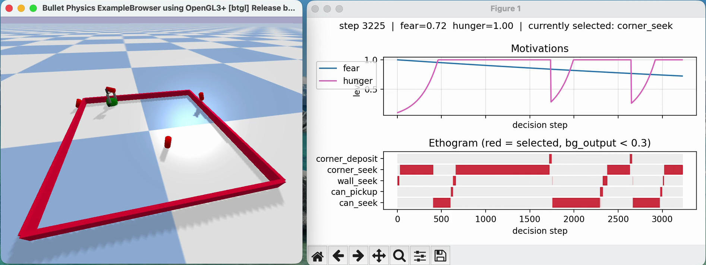

<p align="center">
  
</p>

# Walking and Chewing Gum: A Vertebrate Basal Ganglia Robot under Realistic Contact Physics

[](https://doi.org/10.5281/zenodo.22898109)

> Montes Gonzalez, F. (2026). *Walking and Chewing Gum: A Basal Ganglia Vertebrate Robot Under Realistic Contact Physics*. Preprints.org. https://doi.org/10.20944/preprints202609.2037.v1

A Python and PyBullet implementation of the basal ganglia model described in Gonzalez et al. (2000) and Prescott et al. (2006), using the actual Khepera I geometry and gripper, and reproducing the original foraging task in a modern rigid-body physics simulation.

This implementation follows the **embedded action selection architecture (EASA)**: action selection (here, the basal ganglia model) is embedded directly in the sensorimotor loop of a physically simulated robot, rather than evaluated in the abstract.

## Contents

- `bg_core.py`, `bg_sensors.py`, `bg_behaviors.py`, `bg_motor.py` — basal ganglia model core, ported constant-by-constant.
- `easa_standalone.py` — complete simulation: robot + foraging task.
- `easa_arena.py` — environment definition.
- `khepera_real.urdf` — actual robot geometry, extracted from Webots files.
- `easa_config.json` — configuration parameters for a run.
- `easa_plot.py`, `easa_live_plot.py` — visualization of motivations and ethogram (live or post-hoc).
- `run_dopamine_sweep.sh` — systematic dopamine sweep, executed in parallel.
- `aggregate_sweep_results.py` — statistical aggregation of the sweep (Kruskal-Wallis, Fisher, Mann-Whitney, Holm-Bonferroni).
- `analyze_deposit_physics.py` — classification of the physical outcome of each deposit attempt.
- `count_aborted_pickups.py`, `analyze_channel_time.py`, `analyze_channel_switching.py` — selection circuit diagnostics.

## Installation

```bash
pip install -r requirements.txt
```

## Basic usage

```bash
python3 easa_standalone.py
```

For a headless run with specific parameters:

```bash
EASA_HEADLESS=1 EASA_DOPAMINE_D1=0.2 EASA_DOPAMINE_D2=0.2 python3 easa_standalone.py
```

## Visualization

`easa_standalone.py` only runs the simulation and writes the log; plotting is a separate process. While a run is going (or afterwards), open a **new terminal**, activate the same environment, and from the repo directory run one of:

- **Live view**, updating as the simulation progresses:

```bash
  python3 easa_live_plot.py
```

- **Static view**, once a run has finished, to see the ethogram, motivations, etc. from the most recent log:

```bash
  python3 easa_plot.py
```

For the full dopamine sweep:

```bash
REPS=20 MAX_PARALLEL_JOBS=8 ./run_dopamine_sweep.sh
python3 aggregate_sweep_results.py
```

## Citation

If you use this code, please cite:

> Montes Gonzalez, F. (2026). *Walking and Chewing Gum: A Basal Ganglia Vertebrate Robot Under Realistic Contact Physics*. Preprints.org. https://doi.org/10.20944/preprints202609.2037.v1

Code archive (Zenodo): https://doi.org/10.5281/zenodo.22898109

## License

MIT. See [LICENSE](LICENSE).
